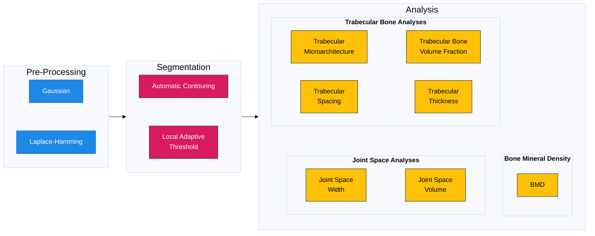

# Workflows



## Prerequisites

**Please see below for general pre-requisites for running workflows**

Install the package below so console scripts are available:

```bash
pip install -e .
```

After this, run any workflow by script name:
```bash
<workflow_name.py> -h
```

## Current Workflows

### Bone segmentation

- [Segmentation](workflows/modules/segmentation/segmentation_modules.md)

### Morphology-Based Measurements

- [Morphology](workflows/modules/morphology/morphology_modules.md)

### Bone Mineral Density (BMD) techniques

- [Bone Mineral Density](workflows/modules/bmd/bmd_modules.md)


