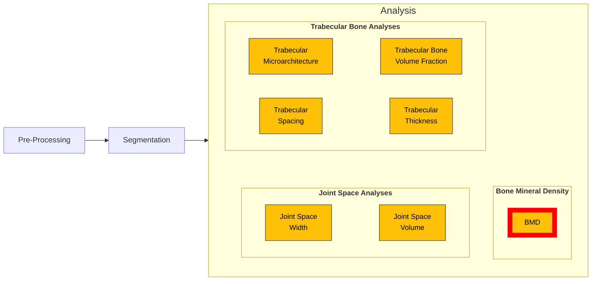

# BMD Workflows

This page contains Python files for running bone mineral density workflows. Default inputs are listed for all of these files below.



::::{tab-set}

<!-- Tab 1: BMD (Image Only) -->
:::{tab-item} BMD Statistics (Image Only)
:sync: tab1

- [BMD Statistics (Image Only)](bmd_workflow.py)

Computes whole-image BMD statistics (mean/std) and prints to stdout.

```bash
bmd IMAGE [--image_units IMAGE_UNITS] [--mu_scaling MU_SCALING] [--mu_water MU_WATER] [--rescale_slope RESCALE_SLOPE] [--rescale_intercept RESCALE_INTERCEPT]
```

- `IMAGE` (required): input image
- `--image_units` (optional, default `BMD`): one of `BMD`, `SCANCO`, `ATTENUATION`, `HU`
- `--mu_scaling` (optional, default `8192`)
- `--mu_water` (optional, default `0.25`)
- `--rescale_slope` (optional, default `1600.0`)
- `--rescale_intercept` (optional, default `-390.0`)

Example:

```bash
bmd sample.nii --image_units BMD
```

:::

<!-- Tab 2: BMD (Image and Mask Inputs) -->
:::{tab-item} BMD Statistics (Image and Mask)
:sync: tab2

- [BMD Statistics (Image and Mask)](bmd_masked_workflow.py)

Computes BMD statistics inside a segmentation mask and prints mean/std.

```bash
bmd_masked IMAGE IMAGE_SEG [--image_units IMAGE_UNITS] [--mu_scaling MU_SCALING] [--mu_water MU_WATER] [--rescale_slope RESCALE_SLOPE] [--rescale_intercept RESCALE_INTERCEPT]
```

- `IMAGE` (required): input image
- `IMAGE_SEG` (required): mask image
- Optional parameters/defaults are the same as `bmd`

Example:

```bash
bmd_masked sample.nii sample_MASK.nii --image_units BMD
```

:::

::::
