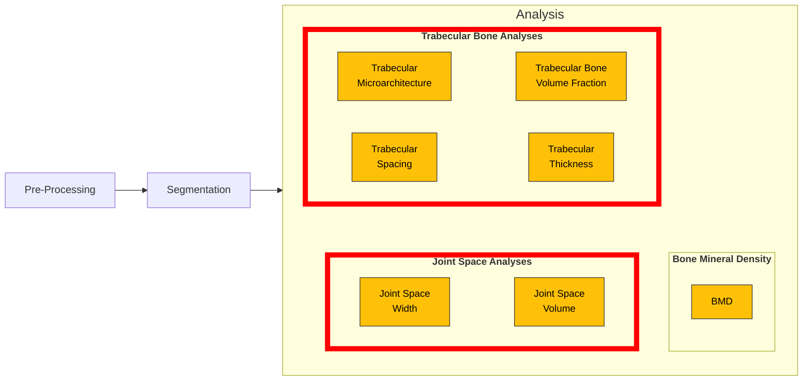

# Morphology Measurement Workflows

This page contains Python files for running morphology-related workflows (e.g. measuring trabecular thickness, joint space width). Default inputs are listed for all of these files below.



::::{tab-set}

<!-- Tab 1: Joint Space Width Analysis -->
:::{tab-item} Joint Space Width
:sync: tab1

- [Joint Space Width Analysis](jsw_analysis_workflow.py)

Runs the joint-space-width (JSW) analysis pipeline on a binary joint segmentation.

**🚧 Workflow under construction 🚧**

```bash
jsw_main JOINT_SEG
```

- `JOINT_SEG`: joint segmentation image

Outputs (same directory as input):
- `*_DILATE.nii`
- `*_ERODE.nii`
- `*_JS_MASK.nii`
- `*_DILATED_JS_MASK.nii`
- `*_DT.nii`
- JSW parameter text output (written by `jsw_parameters`)

Example:

```bash
jsw_main joint_mask.nii
```

:::

<!-- Tab 2: Trabecular Microarchitecture -->
:::{tab-item} Trabecular Microarchitecture
:sync: tab2

**🚧 Workflow under construction 🚧**

- [Trabecular Microarchitecture](trab_microarchitecture_workflow.py)

Computes trabecular microarchitecture parameters based on a trabecular segmentation image and periosteal mask images.

```bash
trab-archoarch INPUT_IMAGE PERI_MASK
```

- `INPUT_IMAGE`: input trabecular segmentation image
- `PERI_MASK`: image of the periosteal mask

Outputs (same directory as input):
- `*.csv`
- `TbTh.nii`
- `TbSp.nii`


:::

<!-- Tab 3: Trabecular Bone Volume Fraction -->
:::{tab-item} Trabecular Bone Volume Fraction (Tb.TV/BV)
:sync: tab3

- [Trabecular Bone Volume Fraction](trab_bvtv_workflow.py)

**🚧 Workflow under construction 🚧**

:::

<!-- Tab 4: Trabecular Thickness -->
:::{tab-item} Trabecular Thickness
:sync: tab4

- [Trabecular Thickness](trab_th_workflow.py)

**🚧 Workflow under construction 🚧**

:::

<!-- Tab 5: Trabecular Spacing -->
:::{tab-item} Trabecular Spacing
:sync: tab5

- [Trabecular Spacing](trab_sp_workflow.py)

**🚧 Workflow under construction 🚧**


:::

::::
