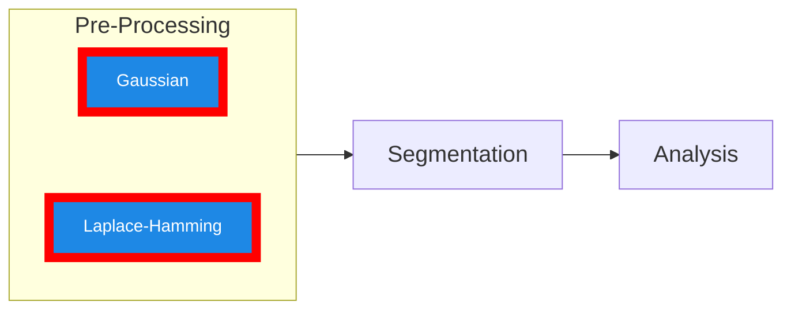

# Pre-Processing Workflows

This page contains the Python pre-processing modules that can be used for XCT images. Default inputs are listed for all of these files below.

## Prerequisites

Install the package so console scripts are available:



::::{tab-set}


<!-- Tab 1: Laplace-Hamming filtering -->
:::{tab-item} FFT Laplace-Hamming Filter
:sync: tab1

- [FFT Laplace](fft_laplace_hamming_workflow.py)

Runs Laplace-Hamming based filtering and writes the output image.

```bash
fft_laplace INPUT_IMAGE OUTPUT_PATH [--upper UPPER] [--lower LOWER]
```

- `INPUT_IMAGE` (required)
- `OUTPUT_PATH` (required)
- `--upper` (optional): upper threshold
- `--lower` (optional): lower threshold

If thresholds are omitted, internal defaults in `segmentation_laplace_hamming` are used.

Examples:

```bash
fft_laplace sample.nii sample_fft_seg.nii
fft_laplace sample.nii sample_fft_seg.nii --lower 120 --upper 1000
```

:::

<!-- Tab 2: Gaussian segmentation -->
:::{tab-item} Gaussian segmentation
:sync: tab2

- [Gaussian segmentation](seg_gauss_workflow.py)

Binarizes an image using the standard Gaussian segmentation protocol.

```bash
gauss_seg INPUT_IMAGE OUTPUT_IMAGE [--image_units IMAGE_UNITS]
```

- `INPUT_IMAGE` (required)
- `OUTPUT_IMAGE` (required)
- `--image_units` (optional, default `BMD`): one of `BMD`, `SCANCO`, `ATTENUATION`, `HU`, `PER1000`

Example:

```bash
gauss_seg sample.nii sample_seg.nii --image_units BMD
```

:::

::::
