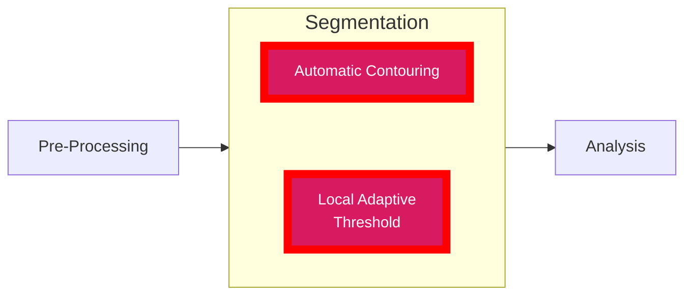

# Segmentation Workflows

This page contains the Python modules needed for running segmentation workflows. Default inputs are listed for all of these files below.


::::{tab-set}

<!-- Tab 1: Automatic Contouring -->
:::{tab-item} Automatic Contouring
:sync: tab1

- [Automatic Contouring](autocontour_workflow.py)

Runs automatic contouring and writes three masks beside the input image.

```bash
autocontour IMAGE_PATH [--mu_water MU_WATER] [--rescale_slope RESCALE_SLOPE] [--rescale_intercept RESCALE_INTERCEPT]
```

- `IMAGE_PATH` (required): input image path
- `--mu_water` (optional, default `0.2409`)
- `--rescale_slope` (optional, default `1603.51904`)
- `--rescale_intercept` (optional, default `-391.209015`)

Outputs (same folder as input basename):
- `*_MASK.nii`
- `*_PRX_MASK.nii`
- `*_DST_MASK.nii`

Example:

```bash
autocontour sample.nii --mu_water 0.2409 --rescale_slope 1603.51904 --rescale_intercept -391.209015
```

:::

<!-- Tab 2: Automatic Contouring (GOBJ) -->
:::{tab-item} Automatic Contouring (GOBJ files)
:sync: tab2

- [Automatic Contouring (Distal/Proximal GOBJ Contours)](autocontour_gobj_workflow.py)

Runs autocontour using distal/proximal GOBJ contours as guidance.

```bash
autocontour_gobj IMAGE_PATH DST_GOBJ_PATH PRX_GOBJ_PATH
```

- `IMAGE_PATH`: input image path
- `DST_GOBJ_PATH`: distal contour GOBJ path
- `PRX_GOBJ_PATH`: proximal contour GOBJ path

Outputs:
- `*_MASK.nii`
- `*_PRX_MASK.nii`
- `*_DST_MASK.nii`

Example:

```bash
autocontour_gobj sample.nii sample_dst.gobj sample_prx.gobj
```

:::

<!-- Tab 3: Local Adaptive Thresholding Segmentation -->
:::{tab-item} Local Adaptive Thresholding
:sync: tab3

- [Local Adaptive Thresholding](adaptive_local_threshold_workflow.py)

Performs adaptive local threshold segmentation.

```bash
local_adaptive_threshold INPUT OUTPUT [options]
```

Required:
- `INPUT`: input image
- `OUTPUT`: output segmented image

Options:
- `--lower-threshold`, `-lt` (default `190`)
- `--upper-threshold`, `-ut` (default `450`)
- `--structuring-element-size`, `-sz` (default `6`)
- `--structuring-element-shape`, `-sh` (default `ball`, choices: `ball`, `cube`)
- `--sigma`, `-sg` (default `None`)
- `--minimum-structure-size`, `-ms` (default `64`)
- `--local-threshold-method`, `-ltm` (default `mean`, choices: `mean`, `minmax`, `both`)

Example:

```bash
local_adaptive_threshold sample.nii sample_local_seg.nii -lt 190 -ut 450 -sh ball -sz 6
```

:::

::::
